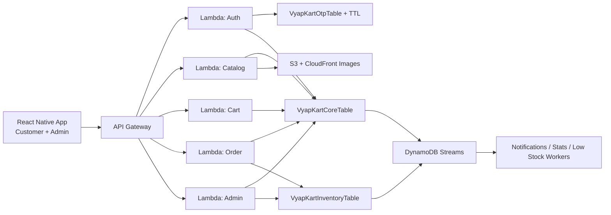
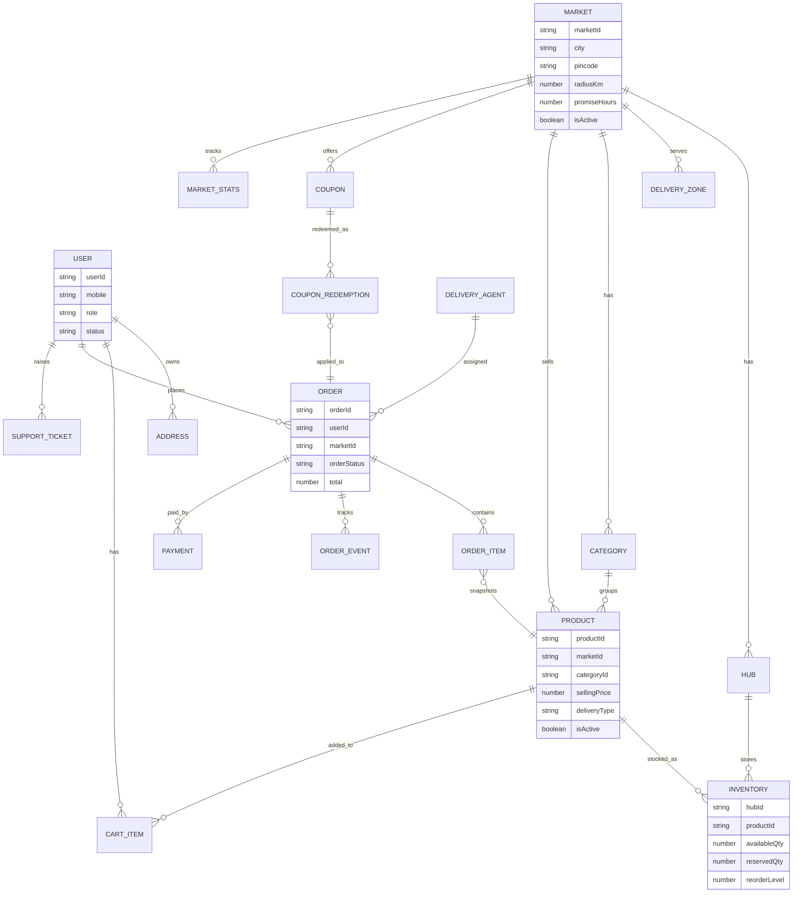
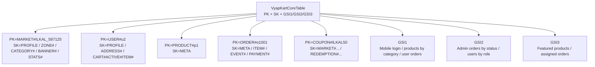
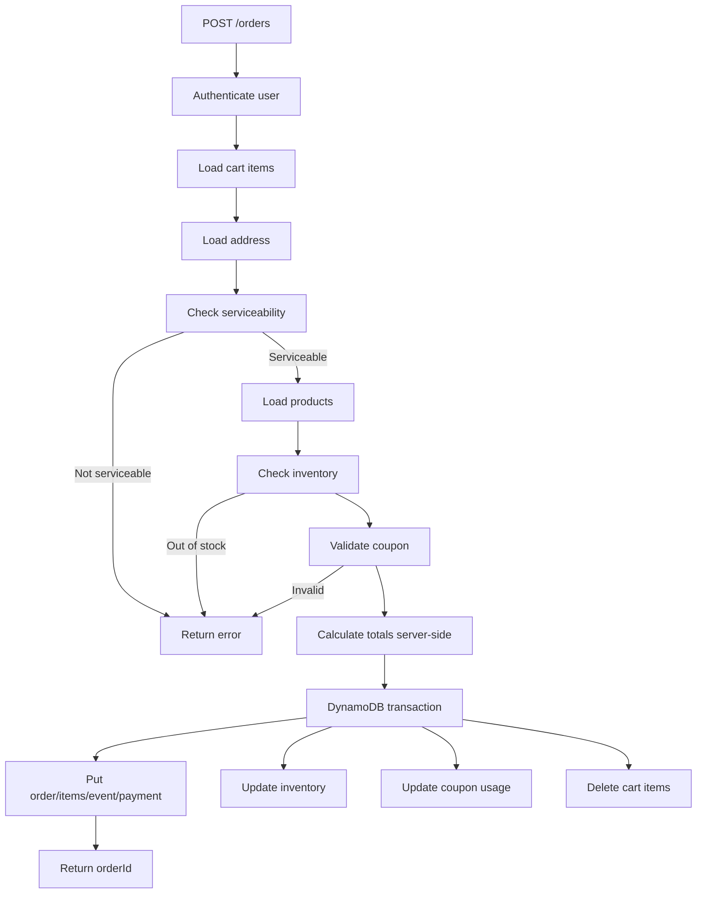

# vyap_kart

# VyapKart Backend and Database Design Document

**Application:** VyapKart  
**Current frontend:** React Native mobile app with customer and admin flows  
**Target backend:** AWS API Gateway, AWS Lambda, Amazon DynamoDB, S3/CloudFront later for images  
**Initial business market:** Ilkal - 587125  
**Business promise:** local-area delivery within 24 hours  
**Design goal:** move from hardcoded JSON/frontend-only data to a real-world serverless backend and database design.

## Table of contents

1. Executive summary
2. What the frontend currently needs from the backend
3. Business assumptions and design principles
4. Logical ER diagram
5. Recommended DynamoDB table strategy
6. Access patterns
7. Entity design details
8. OTP/auth table
9. Serviceability and radius logic
10. Order placement transaction
11. API design mapped to the frontend
12. Product search design
13. Security and authorization
14. Admin dashboard design
15. Frontend model changes recommended
16. Issues noticed in the current frontend code
17. Migration plan from hardcoded frontend data
18. Additional ideas for VyapKart
19. Implementation checklist
20. Final recommended high-level structure
21. References

---

# 1. Executive summary

VyapKart is a local-first ecommerce and quick-commerce style application. The current frontend already contains the foundation for a real commerce backend: login, customer profile, address selection, serviceability check, home banners, categories, product browsing, search, product details, cart, checkout, payment method selection, order success, order tracking, admin dashboard, product management, inventory management, coupons, delivery zones, users, and order details.

The recommended backend is a serverless AWS architecture:



The core database should use DynamoDB with a design based on access patterns, not a simple one-table-per-JSON-file approach. This document recommends:

- **VyapKartCoreTable** for users, addresses, markets, delivery zones, categories, products, banners, coupons, carts, orders, order items, order events, payments, support tickets, and operational stats.
- **VyapKartInventoryTable** for hub-level stock, reservation, stock ledger, low-stock checks, and admin inventory operations.
- **VyapKartOtpTable** for OTP login sessions with TTL expiry.
- **Optional VyapKartSearchTable or OpenSearch later** for better product search, autocomplete, typo tolerance, and ranking.

This design fits the current Ilkal MVP and also supports future expansion into more cities, multiple hubs, delivery agents, online payments, offers, customer support, analytics, returns, and local merchant/seller onboarding.

---

# 2. What the frontend currently needs from the backend

From the code shared, the current data files and services map to these backend domains:

| Frontend data/service | Real backend domain | Notes |
|---|---|---|
| `users` | User/account/auth domain | Customer and admin roles already exist. |
| `addresses` | Address and serviceability domain | Needs pincode, area, latitude, longitude, radius logic. |
| `categories` | Catalog category domain | Admin can add/toggle categories. |
| `products` | Product catalog domain | Admin can create/edit/toggle products. |
| `inventory` | Stock management domain | Should be separated from product master data. |
| `cart` | Active cart domain | Should store cart items separately, not as one large array. |
| `orders` | Order and checkout domain | Order snapshots are already used correctly. |
| `coupons` | Promotion/discount domain | Needs usage tracking and validation. |
| `zones` | Delivery/service area domain | Should support pincode, area, and radius. |
| `banners` | Home/marketing domain | Should be market-specific. |
| `authService` | OTP authentication | Replace mock OTP `1234` with backend OTP session. |
| `productService` | Catalog API | Home, categories, product list/details/search. |
| `cartService` | Cart API | Add/update/remove/cart total. |
| `addressService` | Address API | List/default address and serviceability. |
| `orderService/orderStore` | Checkout/order/tracking API | Place order, list my orders, track order. |

Important frontend observation: the admin `OrdersScreen` currently appears to be duplicated from `InventoryScreen`; it renders inventory rather than orders. This should be corrected before connecting the backend.

---

# 3. Business assumptions and design principles

## 3.1 Local-first business model

VyapKart should not be modeled as a generic national ecommerce application on day one. It is local-first.

Initial market:

```text
marketId: ILKAL_587125
city: Ilkal
pincode: 587125
promiseHours: 24
```

Every customer-facing and admin-facing operation should understand the active `marketId`. This avoids hardcoding Ilkal permanently and allows future expansion to additional towns or areas.

Example future markets:

```text
ILKAL_587125
BAGALKOT_587101
HUNAGUND_587118
KUSHTAGI_583277
```

## 3.2 Key design rules

1. **Keep catalog and inventory separate.** Product details change slowly; inventory changes frequently and must be protected with conditional writes.
2. **Snapshot order data.** Orders should store product name, image, price, and address snapshots so old orders remain historically correct even if products or addresses change later.
3. **Never trust totals from the frontend.** Subtotal, delivery fee, discount, and total must be calculated by Lambda.
4. **Use transactions for order placement.** Order creation, inventory reservation, coupon usage, and cart clearing should succeed or fail together.
5. **Avoid large arrays for growing data.** Cart items, order items, and tracking events should be stored as separate DynamoDB items.
6. **Design for access patterns.** DynamoDB should be queried by known partition/sort keys and indexes rather than scanning entire tables.
7. **Make serviceability dynamic.** Do not only check `city === Ilkal` and `pincode === 587125`. Use market, zone, pincode, area, radius, and capacity checks.
8. **Prepare for multiple hubs.** Even if there is only one local stock location today, the schema should support future hubs.

---

# 4. Logical ER diagram

The following ER-style diagram shows the business objects and relationships. In DynamoDB, these are not necessarily separate relational tables, but this diagram helps the dev team understand the domain.



---

# 5. Recommended DynamoDB table strategy

## 5.1 Why not create one table per frontend JSON file?

The frontend currently has JSON files like `users.ts`, `products.ts`, `orders.ts`, and `inventory.ts`. In SQL, this might become one table per file. In DynamoDB, that approach is usually not ideal.

DynamoDB works best when you model based on how the app reads and writes data. Items with the same partition key are grouped together, and the sort key is used to organize related items. This helps with access patterns such as:

- Get all addresses for a user.
- Get active cart items for a user.
- Get all items/events/payments for an order.
- Get all categories and banners for a market.
- Get products by category.
- Get orders by customer.
- Get admin orders by status.
- Get inventory by hub.

## 5.2 Recommended tables

```text
VyapKartCoreTable
  Users, addresses, markets, zones, categories, products, banners,
  coupons, coupon redemptions, cart items, orders, order items,
  order events, payments, support tickets, stats.

VyapKartInventoryTable
  Product stock by hub, reserved stock, reorder levels,
  stock ledger, low-stock admin views.

VyapKartOtpTable
  Login OTP sessions with TTL expiry.

Optional later:
  VyapKartSearchTable or Amazon OpenSearch
  Product search, autocomplete, typo tolerance, ranking.
```

## 5.3 Core table key design



Base table:

```text
Table: VyapKartCoreTable
PK: string
SK: string
GSI1PK: string
GSI1SK: string
GSI2PK: string
GSI2SK: string
GSI3PK: string
GSI3SK: string
expiresAt: number optional
```

Use consistent entity prefixes:

```text
MARKET#ILKAL_587125
USER#u2
PRODUCT#p1
ORDER#o1001
COUPON#ILKAL50
HUB#h1
AGENT#rider1
```

---

# 6. Access patterns

The database is designed to serve these current and future application screens.

| Access pattern | Used by | Suggested key/index |
|---|---|---|
| Get market profile | App startup/home/profile | `PK=MARKET#marketId`, `SK=PROFILE` |
| Get active delivery zones | Address/checkout/admin | `PK=MARKET#marketId`, `SK begins_with ZONE#` |
| Login by mobile | Auth | `GSI1PK=MOBILE#mobile` |
| Get user profile | Auth/profile/admin | `PK=USER#userId`, `SK=PROFILE` |
| Get user addresses | Address/checkout | `PK=USER#userId`, `SK begins_with ADDRESS#` |
| Get categories | Home/categories/admin | `PK=MARKET#marketId`, `SK begins_with CATEGORY#` |
| Get banners | Home | `PK=MARKET#marketId`, `SK begins_with BANNER#` |
| Get product by id | Product details/cart/order | `PK=PRODUCT#productId`, `SK=META` |
| Get products by category | Product list | `GSI1PK=MARKET#marketId#CATEGORY#categoryId` |
| Get featured products | Home | `GSI3PK=MARKET#marketId#FEATURED` |
| Search products | Search screen | MVP token index or OpenSearch later |
| Get active cart | Cart/checkout | `PK=USER#userId`, `SK begins_with CART#ACTIVE#ITEM#` |
| Get my orders | MyOrders screen | `GSI1PK=USER#userId`, `GSI1SK begins_with ORDER#` |
| Get order details | Tracking/admin | `PK=ORDER#orderId` |
| Admin orders by status | Admin orders | `GSI2PK=MARKET#marketId#ORDER_STATUS#status` |
| Inventory by hub | Admin inventory | Inventory table `PK=HUB#hubId` |
| Low stock items | Admin dashboard | Inventory GSI or stats item |
| Assigned orders | Delivery agent app later | `GSI3PK=AGENT#agentId` |

---

# 7. Entity design details

## 7.1 Market

A market represents a city/pincode operating area. For the MVP, the main market is Ilkal - 587125.

```text
PK = MARKET#ILKAL_587125
SK = PROFILE
```

Example item:

```json
{
  "entityType": "MARKET",
  "marketId": "ILKAL_587125",
  "name": "Ilkal Main Market",
  "city": "Ilkal",
  "pincode": "587125",
  "centerLat": 15.9592,
  "centerLng": 76.1137,
  "radiusKm": 8,
  "promiseHours": 24,
  "isActive": true,
  "minOrderAmount": 0,
  "defaultDeliveryFee": 20,
  "freeDeliveryAbove": 499,
  "supportPhone": "+91 98765 43210",
  "supportEmail": "support@vyapkart.com",
  "createdAt": "2025-01-01T09:00:00.000Z",
  "updatedAt": "2025-01-01T09:00:00.000Z"
}
```

Why this matters:

- Makes Ilkal configurable instead of hardcoded.
- Allows future market expansion.
- Stores service promise and delivery pricing rules.
- Supports city-level admin dashboards.

## 7.2 Hub / fulfillment center

A hub is the place where stock is stored and from where orders are fulfilled. For the MVP, this can be one local Ilkal store or warehouse.

```text
PK = MARKET#ILKAL_587125
SK = HUB#h1
```

Example item:

```json
{
  "entityType": "HUB",
  "hubId": "h1",
  "marketId": "ILKAL_587125",
  "name": "Ilkal Main Hub",
  "address": "Ilkal local fulfillment point",
  "lat": 15.9592,
  "lng": 76.1137,
  "isActive": true,
  "dailyOrderCapacity": 150
}
```

Even if you start from one hub, keeping `hubId` in orders and inventory avoids redesign when you open another local fulfillment point.

## 7.3 Delivery zone

Current frontend zones have city, pincode, areas, and active status. The backend should add radius and service promise.

```text
PK = MARKET#ILKAL_587125
SK = ZONE#z1
```

Example item:

```json
{
  "entityType": "DELIVERY_ZONE",
  "zoneId": "z1",
  "marketId": "ILKAL_587125",
  "name": "Ilkal Main Zone",
  "city": "Ilkal",
  "pincode": "587125",
  "areas": [
    "Bus Stand Road",
    "Shivaji Circle",
    "Market Road",
    "Mahantesh Nagar",
    "College Road",
    "Station Area"
  ],
  "centerLat": 15.9592,
  "centerLng": 76.1137,
  "radiusKm": 8,
  "promiseHours": 24,
  "isActive": true
}
```

Serviceability should check:

1. Market is active.
2. Pincode is supported.
3. Area is supported or falls inside radius.
4. Address latitude/longitude is within allowed distance.
5. Delivery capacity is available for the selected day/slot.

## 7.4 User

```text
PK = USER#u2
SK = PROFILE
GSI1PK = MOBILE#9876543210
GSI1SK = USER#u2
GSI2PK = MARKET#ILKAL_587125#ROLE#customer
GSI2SK = CREATED#2025-01-03T11:30:00.000Z#USER#u2
```

Example item:

```json
{
  "entityType": "USER",
  "userId": "u2",
  "name": "Ravi Patil",
  "mobile": "9876543210",
  "email": "ravi@example.com",
  "role": "customer",
  "status": "active",
  "defaultMarketId": "ILKAL_587125",
  "createdAt": "2025-01-03T11:30:00.000Z",
  "updatedAt": "2025-01-03T11:30:00.000Z"
}
```

For production, also create a uniqueness guard item:

```text
PK = UNIQUE#MOBILE#9876543210
SK = USER#u2
```

This prevents duplicate users with the same mobile number.

## 7.5 Address

```text
PK = USER#u2
SK = ADDRESS#a1
```

Example item:

```json
{
  "entityType": "ADDRESS",
  "addressId": "a1",
  "userId": "u2",
  "fullAddress": "Near Bus Stand, Ward No 4, Ilkal",
  "landmark": "Opposite Hanuman Temple",
  "area": "Bus Stand Road",
  "city": "Ilkal",
  "pincode": "587125",
  "lat": 15.9592,
  "lng": 76.1137,
  "isDefault": true,
  "serviceableMarketId": "ILKAL_587125",
  "lastServiceabilityCheck": {
    "serviceable": true,
    "distanceKm": 1.2,
    "promiseHours": 24
  },
  "createdAt": "2025-01-03T11:30:00.000Z",
  "updatedAt": "2025-01-03T11:30:00.000Z"
}
```

Address location accuracy is important because the brand promise depends on local radius delivery.

## 7.6 Category

```text
PK = MARKET#ILKAL_587125
SK = CATEGORY#001#c1
```

Example item:

```json
{
  "entityType": "CATEGORY",
  "categoryId": "c1",
  "marketId": "ILKAL_587125",
  "name": "Groceries",
  "slug": "groceries",
  "image": "s3://vyapkart-catalog/categories/groceries.png",
  "sortOrder": 1,
  "isActive": true,
  "createdAt": "2025-01-01T09:00:00.000Z",
  "updatedAt": "2025-01-01T09:00:00.000Z"
}
```

## 7.7 Product

The product item should store catalog data, not the source-of-truth stock. Inventory should be in the inventory table.

```text
PK = PRODUCT#p1
SK = META
GSI1PK = MARKET#ILKAL_587125#CATEGORY#c1
GSI1SK = ACTIVE#1#NAME#sona-masoori-rice-5kg
GSI3PK = MARKET#ILKAL_587125#FEATURED
GSI3SK = RANK#001#PRODUCT#p1
```

Example item:

```json
{
  "entityType": "PRODUCT",
  "productId": "p1",
  "marketId": "ILKAL_587125",
  "name": "Sona Masoori Rice 5kg",
  "slug": "sona-masoori-rice-5kg",
  "description": "Premium quality Sona Masoori rice for daily cooking.",
  "categoryId": "c1",
  "brand": "Vyapkart Select",
  "images": ["s3://vyapkart-products/p1/main.jpg"],
  "mrp": 420,
  "sellingPrice": 379,
  "weight": 5,
  "unit": "kg",
  "deliveryType": "24hr",
  "isActive": true,
  "isFeatured": true,
  "maxOrderQty": 5,
  "taxRate": 0,
  "createdAt": "2025-01-01T09:00:00.000Z",
  "updatedAt": "2025-01-01T09:00:00.000Z"
}
```

Frontend can still display stock, but stock should be joined/added from inventory, not permanently trusted from the product item.

## 7.8 Banner

```text
PK = MARKET#ILKAL_587125
SK = BANNER#001#b1
```

Example item:

```json
{
  "entityType": "BANNER",
  "bannerId": "b1",
  "marketId": "ILKAL_587125",
  "title": "24 Hour Delivery in Ilkal",
  "subtitle": "Fast delivery for daily essentials in 587125",
  "image": "s3://vyapkart-banners/b1.jpg",
  "targetType": "offer",
  "targetId": "delivery-offer",
  "sortOrder": 1,
  "startsAt": "2025-01-01T00:00:00.000Z",
  "endsAt": "2026-12-31T23:59:59.000Z",
  "isActive": true
}
```

## 7.9 Inventory

Inventory should live in `VyapKartInventoryTable` because stock changes are frequent and must be updated safely.

```text
Table: VyapKartInventoryTable
PK = HUB#h1
SK = PRODUCT#p1
GSI1PK = PRODUCT#p1
GSI1SK = HUB#h1
Optional GSI2PK = HUB#h1#LOW_STOCK
Optional GSI2SK = PRODUCT#p1
```

Example item:

```json
{
  "entityType": "INVENTORY",
  "hubId": "h1",
  "marketId": "ILKAL_587125",
  "productId": "p1",
  "availableQty": 25,
  "reservedQty": 2,
  "reorderLevel": 5,
  "version": 7,
  "lastRestockedAt": "2025-01-10T09:00:00.000Z",
  "updatedAt": "2025-01-10T09:00:00.000Z"
}
```

Recommended stock flow:

```text
When order is placed:
  availableQty decreases
  reservedQty increases

When order is delivered:
  reservedQty decreases

When order is cancelled before delivery:
  reservedQty decreases
  availableQty increases
```

Also store stock ledger items for audit:

```text
PK = HUB#h1#PRODUCT#p1
SK = STOCK_LEDGER#2025-01-10T10:15:00.000Z#ORDER#o1001
```

## 7.10 Cart item

Do not store the whole cart as one item with an array. Store one item per product in the active cart.

```text
PK = USER#u2
SK = CART#ACTIVE#ITEM#p1
```

Example item:

```json
{
  "entityType": "CART_ITEM",
  "userId": "u2",
  "marketId": "ILKAL_587125",
  "productId": "p1",
  "quantity": 1,
  "priceSnapshot": 379,
  "productSnapshot": {
    "name": "Sona Masoori Rice 5kg",
    "image": "s3://vyapkart-products/p1/main.jpg",
    "brand": "Vyapkart Select",
    "weight": 5,
    "unit": "kg"
  },
  "addedAt": "2025-01-10T10:00:00.000Z",
  "updatedAt": "2025-01-10T10:00:00.000Z"
}
```

Cart totals should be calculated by Lambda:

```text
subtotal = sum(priceSnapshot * quantity)
deliveryFee = market delivery rule
couponDiscount = coupon rule if applied
grandTotal = subtotal + deliveryFee - couponDiscount
```

## 7.11 Coupon

```text
PK = COUPON#ILKAL50
SK = MARKET#ILKAL_587125
```

Example item:

```json
{
  "entityType": "COUPON",
  "couponId": "cp1",
  "code": "ILKAL50",
  "marketId": "ILKAL_587125",
  "type": "flat",
  "value": 50,
  "minOrderAmount": 500,
  "maxDiscount": 50,
  "usageLimit": 100,
  "usedCount": 0,
  "perUserLimit": 1,
  "expiryDate": "2026-12-31T23:59:59.000Z",
  "isActive": true
}
```

## 7.12 Coupon redemption

```text
PK = COUPON#ILKAL50
SK = REDEMPTION#USER#u2#ORDER#o1001
```

Example item:

```json
{
  "entityType": "COUPON_REDEMPTION",
  "code": "ILKAL50",
  "userId": "u2",
  "orderId": "o1001",
  "discountAmount": 50,
  "redeemedAt": "2025-01-10T10:15:00.000Z"
}
```

During order placement, coupon usage should be conditionally updated so `usedCount` cannot exceed `usageLimit`.

## 7.13 Order

Your current frontend correctly stores snapshots for address and item details. Keep that pattern.

```text
PK = ORDER#o1001
SK = META
GSI1PK = USER#u2
GSI1SK = ORDER#2025-01-10T10:15:00.000Z#o1001
GSI2PK = MARKET#ILKAL_587125#ORDER_STATUS#packed
GSI2SK = CREATED#2025-01-10T10:15:00.000Z#ORDER#o1001
GSI3PK = AGENT#rider1
GSI3SK = STATUS#packed#CREATED#2025-01-10T10:15:00.000Z
```

Example item:

```json
{
  "entityType": "ORDER",
  "orderId": "o1001",
  "userId": "u2",
  "marketId": "ILKAL_587125",
  "hubId": "h1",
  "addressId": "a1",
  "addressSnapshot": {
    "fullAddress": "Near Bus Stand, Ward No 4, Ilkal",
    "landmark": "Opposite Hanuman Temple",
    "area": "Bus Stand Road",
    "city": "Ilkal",
    "pincode": "587125",
    "lat": 15.9592,
    "lng": 76.1137
  },
  "subtotal": 445,
  "deliveryFee": 20,
  "discount": 40,
  "total": 425,
  "couponCode": "SAVE10",
  "paymentMethod": "cod",
  "paymentStatus": "pending",
  "orderStatus": "packed",
  "deliverySlot": "Today 6 PM - 9 PM",
  "promisedDeliveryBy": "2025-01-11T10:15:00.000Z",
  "assignedTo": "rider1",
  "createdAt": "2025-01-10T10:15:00.000Z",
  "updatedAt": "2025-01-10T10:15:00.000Z"
}
```

Recommended statuses:

```text
placed
confirmed
assigned
packed
out_for_delivery
delivered
cancelled
refund_pending
refunded
```

## 7.14 Order item

```text
PK = ORDER#o1001
SK = ITEM#p2
```

Example item:

```json
{
  "entityType": "ORDER_ITEM",
  "orderId": "o1001",
  "productId": "p2",
  "nameSnapshot": "Toor Dal 1kg",
  "imageSnapshot": "s3://vyapkart-products/p2/main.jpg",
  "priceSnapshot": 149,
  "quantity": 2,
  "lineTotal": 298
}
```

## 7.15 Order event / tracking

The current frontend builds tracking steps from the current status. In production, store status events.

```text
PK = ORDER#o1001
SK = EVENT#2025-01-10T11:00:00.000Z#packed
```

Example item:

```json
{
  "entityType": "ORDER_EVENT",
  "orderId": "o1001",
  "status": "packed",
  "label": "Order packed",
  "message": "Your order has been packed and will be delivered within 24 hours.",
  "createdBy": "admin-u1",
  "createdAt": "2025-01-10T11:00:00.000Z"
}
```

This makes order tracking auditable and more accurate.

## 7.16 Payment

```text
PK = ORDER#o1001
SK = PAYMENT#pay_001
```

Example item:

```json
{
  "entityType": "PAYMENT",
  "paymentId": "pay_001",
  "orderId": "o1001",
  "method": "cod",
  "provider": "manual",
  "status": "pending",
  "amount": 425,
  "createdAt": "2025-01-10T10:15:00.000Z",
  "updatedAt": "2025-01-10T10:15:00.000Z"
}
```

Later, online payment can add:

```text
providerOrderId
providerPaymentId
signature
failureReason
refundStatus
refundId
```

## 7.17 Support ticket

Your `SupportScreen` is static today. Later, add real support tickets.

```text
PK = USER#u2
SK = SUPPORT_TICKET#ticket_001
GSI2PK = MARKET#ILKAL_587125#SUPPORT_STATUS#open
GSI2SK = CREATED#2025-01-10T10:20:00.000Z#ticket_001
```

Example item:

```json
{
  "entityType": "SUPPORT_TICKET",
  "ticketId": "ticket_001",
  "userId": "u2",
  "marketId": "ILKAL_587125",
  "orderId": "o1001",
  "subject": "Delivery issue",
  "message": "Order is delayed",
  "status": "open",
  "priority": "normal",
  "createdAt": "2025-01-10T10:20:00.000Z"
}
```

## 7.18 Market stats

Do not calculate dashboard stats by scanning all orders/products every time.

```text
PK = MARKET#ILKAL_587125
SK = STATS#DAILY#2025-01-10
```

Example item:

```json
{
  "entityType": "MARKET_STATS",
  "marketId": "ILKAL_587125",
  "date": "2025-01-10",
  "totalOrders": 25,
  "pendingOrders": 6,
  "deliveredOrders": 18,
  "cancelledOrders": 1,
  "revenue": 18450,
  "lowStockItems": 4,
  "newCustomers": 3
}
```

---

# 8. OTP/auth table

Use a separate table for OTP sessions.

```text
Table: VyapKartOtpTable
PK = MOBILE#9876543210
SK = OTP#2025-01-10T10:00:00.000Z
TTL attribute = expiresAt
```

Example item:

```json
{
  "mobile": "9876543210",
  "otpHash": "hashed-value",
  "purpose": "login",
  "attempts": 0,
  "maxAttempts": 5,
  "expiresAt": 1736500000,
  "consumed": false,
  "createdAt": "2025-01-10T10:00:00.000Z"
}
```

Important implementation rules:

- Never store OTP in plain text.
- Store a hash of OTP.
- Expire OTP quickly, usually 3-5 minutes.
- Limit attempts.
- Mark consumed after success.
- Even if TTL is enabled, Lambda must still check expiry because expired items may not disappear immediately.

---

# 9. Serviceability and radius logic

The current app checks serviceability roughly by city and pincode. Production logic should be stronger.

Recommended serviceability function:

```text
Input:
  userId
  addressId or lat/lng/pincode/area

Steps:
  1. Load address.
  2. Load active market for pincode.
  3. Load active zones for market.
  4. Check pincode match.
  5. Check area match if configured.
  6. Calculate distance from market/hub/zone center.
  7. Ensure distance <= radiusKm.
  8. Check delivery capacity for promised slot.
  9. Return serviceable, marketId, zoneId, promiseHours, deliveryFee.
```

Haversine distance can be used for MVP radius calculation. For a more advanced version, integrate Maps APIs for road distance and ETA.

Example response:

```json
{
  "serviceable": true,
  "marketId": "ILKAL_587125",
  "zoneId": "z1",
  "distanceKm": 1.2,
  "promiseHours": 24,
  "deliveryFee": 20,
  "message": "Delivery available within 24 hours."
}
```

---

# 10. Order placement transaction

Order placement is the most important backend workflow.



The frontend currently goes:

```text
Cart -> Address -> Checkout -> Payment -> OrderSuccess
```

The real backend should expose:

```text
POST /orders
```

Lambda should perform:

1. Authenticate user.
2. Load active cart items.
3. Load selected address.
4. Check serviceability.
5. Load latest product records.
6. Load inventory records.
7. Validate active products, price rules, max quantity, and stock.
8. Validate coupon if provided.
9. Calculate subtotal, delivery fee, discount, and total server-side.
10. Create order meta item.
11. Create order item records.
12. Create first order event: `placed`.
13. Create payment record.
14. Update inventory using conditions.
15. Update coupon usage and create redemption if coupon was used.
16. Delete active cart items.
17. Return order ID.

Critical writes should be in a DynamoDB transaction. This prevents problems like:

- Order created but stock not reserved.
- Stock reduced but order failed.
- Coupon usage exceeded.
- Cart not cleared after order.
- Two customers buying the last item at the same time.

---

# 11. API design mapped to your frontend

## 11.1 Auth APIs

```text
POST /auth/send-otp
POST /auth/verify-otp
GET  /auth/me
POST /auth/logout
```

Frontend mapping:

```text
authService.sendOtp -> POST /auth/send-otp
authService.verifyOtp -> POST /auth/verify-otp
authService.getMe -> GET /auth/me
```

## 11.2 Catalog APIs

```text
GET /markets/current
GET /home
GET /banners
GET /categories
GET /products
GET /products?categoryId=c1
GET /products/featured
GET /products/search?q=rice
GET /products/{productId}
GET /products/{productId}/related
```

Frontend mapping:

```text
productService.getBanners -> GET /banners
productService.getCategories -> GET /categories
productService.getFeaturedProducts -> GET /products/featured
productService.getProductsByCategory -> GET /products?categoryId=c1
productService.getProductById -> GET /products/{productId}
productService.searchProducts -> GET /products/search?q=...
```

## 11.3 Cart APIs

```text
GET    /cart
POST   /cart/items
PATCH  /cart/items/{productId}
DELETE /cart/items/{productId}
DELETE /cart
POST   /cart/apply-coupon
DELETE /cart/coupon
```

## 11.4 Address and serviceability APIs

```text
GET  /addresses
POST /addresses
PATCH /addresses/{addressId}
DELETE /addresses/{addressId}
POST /serviceability/check
```

## 11.5 Order APIs

```text
POST /orders
GET  /orders/my
GET  /orders/{orderId}
GET  /orders/{orderId}/tracking
POST /orders/{orderId}/cancel
```

## 11.6 Admin APIs

```text
GET  /admin/dashboard
GET  /admin/products
POST /admin/products
PATCH /admin/products/{productId}
GET  /admin/categories
POST /admin/categories
PATCH /admin/categories/{categoryId}
GET  /admin/inventory
PATCH /admin/inventory/{productId}
GET  /admin/orders
GET  /admin/orders/{orderId}
PATCH /admin/orders/{orderId}/status
PATCH /admin/orders/{orderId}/assign
GET  /admin/users
GET  /admin/coupons
POST /admin/coupons
PATCH /admin/coupons/{couponId}
GET  /admin/delivery-zones
POST /admin/delivery-zones
PATCH /admin/delivery-zones/{zoneId}
```

---

# 12. Product search design

## 12.1 MVP DynamoDB token search

For a small local catalog, create token items for simple search.

Product: `Sona Masoori Rice 5kg`  
Tokens:

```text
sona
masoori
rice
5kg
vyapkart
groceries
```

Search token item:

```text
PK = MARKET#ILKAL_587125#SEARCH#rice
SK = PRODUCT#p1
```

Example item:

```json
{
  "entityType": "PRODUCT_SEARCH_TOKEN",
  "marketId": "ILKAL_587125",
  "token": "rice",
  "productId": "p1",
  "name": "Sona Masoori Rice 5kg",
  "sellingPrice": 379,
  "image": "s3://vyapkart-products/p1/main.jpg",
  "isActive": true
}
```

## 12.2 Future search

When catalog grows, use OpenSearch or another search service for:

- typo tolerance,
- autocomplete,
- synonyms,
- better ranking,
- brand/category boosting,
- trending product ranking.

---

# 13. Security and authorization

## 13.1 Roles

Current roles:

```text
admin
customer
```

Recommended future roles:

```text
super_admin
market_admin
inventory_manager
delivery_agent
customer
support_agent
```

## 13.2 API authorization rules

- Customer APIs should only access the authenticated user's own addresses, cart, and orders.
- Admin APIs should require admin role.
- Market admin should only manage assigned market.
- Delivery agent should only see assigned orders.
- Product and inventory writes should be admin-only.
- Order status transitions should be controlled; for example, do not allow `delivered` directly from `placed` unless special admin override is used.

## 13.3 Data protection

- Do not store OTP plain text.
- Do not log OTP values.
- Do not expose internal IDs unnecessarily.
- Store image files in S3 and expose public URLs through CloudFront.
- Use environment variables or AWS Secrets Manager for secrets.
- Use least-privilege IAM policies per Lambda.

---

# 14. Admin dashboard design

The admin dashboard currently calculates counts from arrays:

```text
totalProducts
activeProducts
totalOrders
pendingOrders
lowStockItems
customerCount
```

In production, avoid scanning tables for every dashboard load. Use aggregated stats.

Recommended dashboard sources:

```text
Market profile item
Daily stats item
Inventory low-stock GSI
Order status GSI
User role GSI
```

Example dashboard response:

```json
{
  "marketId": "ILKAL_587125",
  "totalProducts": 120,
  "activeProducts": 112,
  "totalOrdersToday": 35,
  "pendingOrders": 8,
  "lowStockItems": 6,
  "customerCount": 850,
  "revenueToday": 28450
}
```

DynamoDB Streams can later update stats automatically when orders and inventory items change.

---

# 15. Frontend model changes recommended

## Product

Add:

```ts
marketId: string;
status: "draft" | "active" | "inactive";
maxOrderQty: number;
taxRate?: number;
createdAt: string;
updatedAt: string;
stockStatus?: "in_stock" | "low_stock" | "out_of_stock";
```

Change:

```text
Do not treat product.stock as source of truth.
Use inventory availableQty for real stock.
```

## InventoryItem

Add:

```ts
marketId: string;
hubId: string;
version: number;
lastRestockedAt?: string;
updatedAt: string;
```

## Order

Add:

```ts
marketId: string;
hubId: string;
promisedDeliveryBy: string;
statusUpdatedAt: string;
deliveryAgentId?: string;
couponCode?: string;
cancellationReason?: string;
```

## Address

Add:

```ts
serviceableMarketId?: string;
distanceKm?: number;
geoHash?: string;
```

## Coupon

Add:

```ts
usedCount: number;
perUserLimit: number;
maxDiscount?: number;
marketId: string;
```

---

# 16. Issues noticed in the current frontend code

## 16.1 Admin OrdersScreen is likely duplicated from InventoryScreen

The admin `OrdersScreen` imports `inventory` and `products` and renders inventory cards. It should use orders and navigate to `OrderDetails`.

Expected admin order list fields:

```text
orderId
customer/userId
total
paymentMethod
paymentStatus
orderStatus
deliverySlot
assignedTo
createdAt
```

## 16.2 CheckoutScreen and AddressScreen duplicate logic

Both screens currently load addresses and run serviceability checks. This can be acceptable for MVP, but later you should extract reusable components/hooks:

```text
useAddresses()
useServiceabilityCheck()
AddressSelector component
```

## 16.3 Mock OTP must be replaced

Current mock OTP is `1234`. Production should use OTP sessions, hashing, expiry, attempt limits, and SMS provider integration.

## 16.4 Product stock duplication

Current product has `stock` and inventory has `availableQty`. In production, stock source of truth should be inventory. Product may only show a derived stock status.

## 16.5 Cart and order arrays should be split

Frontend arrays are fine for local mock data, but backend should store growing data as separate items:

```text
Cart item per product
Order item per product
Order event per status change
Payment item per payment attempt
```

---

# 17. Migration plan from hardcoded frontend data

## Phase 1 - Backend foundation

1. Create AWS project structure.
2. Create API Gateway.
3. Create Lambda functions by domain.
4. Create DynamoDB tables.
5. Create seed script to import current JSON data.
6. Replace frontend services one by one.

Recommended initial replacement order:

```text
1. productService.getCategories
2. productService.getBanners
3. productService.getFeaturedProducts
4. productService.getProductById
5. authService mock login
6. addressService
7. cartService
8. orderService
9. admin APIs
```

## Phase 2 - Real checkout

1. Implement serviceability check.
2. Implement inventory validation.
3. Implement order transaction.
4. Implement order tracking events.
5. Implement admin status update.
6. Implement coupon usage tracking.

## Phase 3 - Operational readiness

1. Add CloudWatch logs and alarms.
2. Add dashboard stats.
3. Add low-stock alerts.
4. Add real SMS OTP provider.
5. Add S3 image upload for admin products.
6. Add delivery agent assignment.

## Phase 4 - Expansion

1. Add multiple markets.
2. Add multiple hubs.
3. Add merchant/seller onboarding.
4. Add delivery slots and capacity planning.
5. Add online payments and refunds.
6. Add returns/cancellations workflow.

---

# 18. Additional ideas for VyapKart

## 18.1 Delivery capacity and slots

Create delivery capacity items:

```text
PK = MARKET#ILKAL_587125
SK = DELIVERY_CAPACITY#2025-01-10#SLOT#18-21
```

Attributes:

```json
{
  "slotLabel": "6 PM - 9 PM",
  "maxOrders": 50,
  "bookedOrders": 18,
  "isActive": true
}
```

This helps protect the 24-hour promise.

## 18.2 Delivery agent app later

Add a delivery agent role and app screens:

```text
Assigned orders
Route list
Mark out_for_delivery
Mark delivered
Collect COD
Upload proof/photo
```

## 18.3 Local merchant/seller support

If VyapKart becomes a marketplace, add:

```text
Seller
SellerProduct
SellerInventory
Commission
Settlement
```

For the MVP, it is simpler to operate as one local seller/hub.

## 18.4 Notifications

Notify customers on:

```text
order placed
order packed
out for delivery
delivered
cancelled/refunded
```

Channels:

```text
push notification
SMS
WhatsApp later
email optional
```

## 18.5 Returns and cancellations

Add order return entities:

```text
ReturnRequest
Refund
CancellationReason
ReturnPickup
```

For groceries and daily essentials, return policy may differ by product type.

## 18.6 Audit trail

For admin actions, store audit records:

```text
PK = AUDIT#MARKET#ILKAL_587125
SK = 2025-01-10T10:20:00.000Z#admin-u1#UPDATE_PRODUCT#p1
```

This helps debug inventory, pricing, and order status changes.

## 18.7 Pricing history

Store price change history:

```text
PK = PRODUCT#p1
SK = PRICE_HISTORY#2025-01-10T09:00:00.000Z
```

Useful for auditing offers and admin mistakes.

## 18.8 Low-stock alerts

When inventory available quantity goes below reorder level:

```text
availableQty <= reorderLevel
```

Trigger a notification to admin through DynamoDB Streams or a scheduled Lambda.

---

# 19. Implementation checklist

## Backend

- [ ] Create `VyapKartCoreTable`.
- [ ] Create `VyapKartInventoryTable`.
- [ ] Create `VyapKartOtpTable` with TTL.
- [ ] Seed Ilkal market, zones, categories, products, inventory, banners, coupons.
- [ ] Build auth Lambdas.
- [ ] Build catalog Lambdas.
- [ ] Build cart Lambdas.
- [ ] Build serviceability Lambda.
- [ ] Build order placement transaction.
- [ ] Build admin product/category/coupon/zone APIs.
- [ ] Build admin order status/assignment APIs.
- [ ] Add CloudWatch logs and alarms.

## Frontend

- [ ] Replace mock `productService` with API calls.
- [ ] Replace mock `authService` with OTP API.
- [ ] Replace mock `addressService` with address API.
- [ ] Replace mock `cartService` with cart API.
- [ ] Replace order store with order APIs.
- [ ] Fix admin `OrdersScreen`.
- [ ] Remove direct imports from `/data` after backend migration.
- [ ] Add API error handling and loading states.
- [ ] Add token storage and refresh/logout handling.

## Data quality

- [ ] Product slugs are unique per market.
- [ ] Mobile numbers are unique.
- [ ] Product prices are numbers and selling price is not above MRP.
- [ ] Inventory quantity cannot go below zero.
- [ ] Coupon expiry and limits are enforced.
- [ ] Address latitude/longitude is present for radius delivery.
- [ ] Orders always store snapshots.

---

# 20. Final recommended high-level structure

```text
VyapKartCoreTable
  PK, SK
  GSI1PK, GSI1SK
  GSI2PK, GSI2SK
  GSI3PK, GSI3SK
  expiresAt optional
  stream enabled later

Entities:
  MARKET
  HUB
  DELIVERY_ZONE
  USER
  ADDRESS
  CATEGORY
  PRODUCT
  BANNER
  COUPON
  COUPON_REDEMPTION
  CART_ITEM
  ORDER
  ORDER_ITEM
  ORDER_EVENT
  PAYMENT
  SUPPORT_TICKET
  MARKET_STATS
  AUDIT_EVENT later

VyapKartInventoryTable
  PK = HUB#hubId
  SK = PRODUCT#productId
  GSI1PK = PRODUCT#productId
  GSI1SK = HUB#hubId
  optional low-stock GSI

Entities:
  INVENTORY
  STOCK_LEDGER

VyapKartOtpTable
  PK = MOBILE#mobile
  SK = OTP#timestamp
  TTL = expiresAt

Entities:
  OTP_SESSION

Optional later:
  VyapKartSearchTable or Amazon OpenSearch
```

This design is suitable for your current React Native frontend and your actual business requirement: launch first in Ilkal - 587125, support local radius-based delivery, promise delivery within 24 hours, manage real stock, support admin operations, and expand later without rewriting the system.

---

# 21. References

The following AWS documentation pages were used to validate important DynamoDB behavior and constraints:

- Amazon DynamoDB core components: https://docs.aws.amazon.com/amazondynamodb/latest/developerguide/HowItWorks.CoreComponents.html
- Amazon DynamoDB global secondary indexes: https://docs.aws.amazon.com/amazondynamodb/latest/developerguide/GSI.html
- Amazon DynamoDB transactions: https://docs.aws.amazon.com/amazondynamodb/latest/developerguide/transaction-apis.html
- Amazon DynamoDB `TransactWriteItems`: https://docs.aws.amazon.com/amazondynamodb/latest/APIReference/API_TransactWriteItems.html
- Amazon DynamoDB constraints and 400 KB item size: https://docs.aws.amazon.com/amazondynamodb/latest/developerguide/Constraints.html
- Amazon DynamoDB TTL: https://docs.aws.amazon.com/amazondynamodb/latest/developerguide/TTL.html
- DynamoDB Streams with Lambda: https://docs.aws.amazon.com/amazondynamodb/latest/developerguide/Streams.Lambda.html